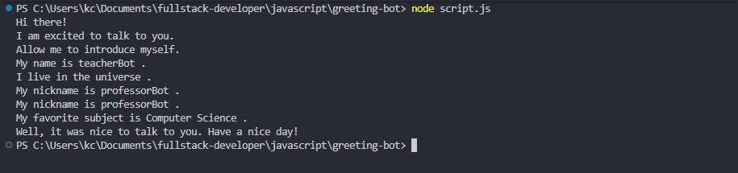

# Workshop : Greeting Bot

## Enoncé 
L’objectif était de creér un bot capable de se présenter en utilisant des variables
et la concaténation de chaines de caractères. Le script démontre la reassignation de variable
et la construction de  phrases dynamiques. 

## Compétences pratiquées

- Déclaration de variables avec **let**.
- Réassignation de valeurs.
- Concaténation de chaines avec l'opérateur `+`
- Utilisation de `console.log()` pour afficher des informations.

## Résultat attendu 
Le bot change de nom plusieurs fois au cours de la présentation et partage son sujet favori(Computer Science).

